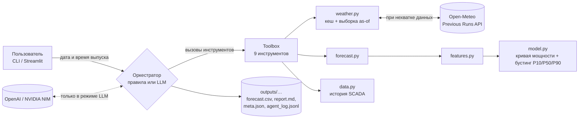

# windcast — агентный прогноз выработки ВЭС на 24–48 часов

Решение кейса HackAlem AI «Agentic AI для прогнозирования выработки ВЭС».

## Краткое описание

Ветроэлектростанция должна заранее сообщать, сколько электроэнергии выдаст в сеть на следующие сутки. Выработка почти полностью определяется ветром, а ветер на завтра известен только из прогноза погоды. Поэтому ошибка прогноза выработки напрямую превращается в отклонения от заявленного графика.

**windcast** получает на вход дату и время выпуска прогноза. Дальше система сама:
1. берёт архивные прогнозы погоды — ровно те, что существовали в этот момент;
2. проверяет их качество;
3. запускает ML-модель;
4. анализирует результат;
5. пересчитывает прогноз, если изменились входные данные;
6. выдаёт почасовой прогноз мощности на 48 часов по каждой турбине и итог по ВЭС в долях номинала, с интервалом неопределённости и отчётом на русском языке.

**Для кого:** диспетчер или аналитик ВЭС, который готовит суточный график генерации, и организаторы хакатона, которым нужно воспроизвести прогноз «как в прошлом» за февраль 2026.

## Что реализовано

- **Загрузка архивных прогнозов погоды** из Open-Meteo Previous Runs API для трёх моделей (GFS, ICON, ECMWF IFS) по координатам каждой турбины. Данные сохраняются в локальный кеш `data/weather/*.parquet` с манифестом (SHA-256, период, дата загрузки).
- **Защита от «подглядывания в будущее».** На каждый час прогноза берётся только тот прогноз погоды, который гарантированно был опубликован к моменту выпуска (правило ниже). Это проверено тестами.
- **Подготовка исторических данных SCADA:**
  - перевод из UTC+6 в UTC;
  - агрегация 10 мин → 1 ч;
  - пометка простоев и ограничений мощности (1.09% часов у T1, 0.68% у T2), которые исключаются из обучения.
- **Диагностика данных** (`windcast diagnose` → [outputs/diagnostics.md](outputs/diagnostics.md)): часовой пояс меток SCADA, точность моделей погоды по заблаговременности, потолок мощности турбин.
- **ML-модель:**
  - эмпирическая кривая мощности (изотоническая регрессия);
  - градиентный бустинг `HistGradientBoostingRegressor` с квантильной функцией потерь, прогноз P10/P50/P90;
  - конформная калибровка ширины интервала;
  - повышенный вес свежих данных (полураспад 365 дней).
- **Прогноз по каждой турбине и итог по ВЭС** (среднее долей), в долях номинала, время UTC+6.
- **Агент** с 9 инструментами и журналом решений (JSONL). Два режима оркестрации:
  - **правила** — детерминированно, без ключей API;
  - **LLM** — OpenAI или NVIDIA NIM через OpenAI-совместимый API; при любой ошибке LLM откатывается на правила.
- **Повторный расчёт:** агент хеширует входные данные. Если для того же момента выпуска входы не изменились, он переиспользует прогноз. Если изменились — пересчитывает и сохраняет прошлую версию в `versions/`.
- **Бэктест тестового периода:** выпуски 31.01–27.02.2026 в 10:00 и 22:00 (56 выпусков), сводная таблица за 01.02–28.02.2026.
- **Честная валидация** на феврале 2025 и январе 2026 со сравнением с тремя базовыми моделями.
- **Добавление турбины по координатам** (CLI и веб-интерфейс). Погоду для неё агент докачивает сам, прогноз делает общая модель парка.
- **Веб-интерфейс на Streamlit:** прогноз по дате и времени, график с P10–P90, таблица, скачивание CSV, отчёт и журнал агента, результаты теста и валидации, карта и управление турбинами.
- **9 автотестов** (pytest): отсутствие утечки, часовой пояс, повторный расчёт, сценарный прогон LLM-агента, откат без ключа, запуск веб-интерфейса.

## Как работает решение

Пользователь вводит момент выпуска, например `2026-02-01 10:00` (UTC+6), и режим агента. Агент выполняет цикл:

1. **check_weather.** Есть ли в кеше прогнозы погоды на 48 ч вперёд для всех турбин и моделей? Если нет, вызывается **fetch_weather**: докачка из Open-Meteo и повторная проверка.
2. **validate_inputs.** Пропуски, физически невозможные значения, расхождение моделей. Непригодные модели погоды исключаются.
3. **check_previous_version.** Был ли уже прогноз этого выпуска и изменились ли входы (хеш погоды + версия модели)? Если не изменились, агент переиспользует готовый прогноз.
4. **run_forecast.** Построение признаков и прогноз P10/P50/P90 на часы T+1 … T+48.
5. **analyze_forecast.** Проверяется:
   - правдоподобность результата (если неправдоподобен — пересчёт на одной лучшей модели погоды);
   - уверенность по средней ширине интервала P10–P90;
   - часы с широким интервалом;
   - сильное расхождение моделей погоды;
   - риск обледенения;
   - резкие изменения мощности.
6. **compare_with_previous / evaluate_recent.** Насколько изменился прогноз относительно прошлого выпуска и какова ошибка прошлых выпусков, если факт уже известен.
7. **Сохранение** в `outputs/…/<ГГГГММДД_ЧЧММ>/`:
   - `forecast.csv` — прогноз;
   - `report.md` — отчёт на русском;
   - `meta.json` — входной хеш, модели погоды, версия модели, решения;
   - `agent_log.jsonl` — журнал: каждый шаг с обоснованием и результатом.

В LLM-режиме порядок шагов и решения (какие модели погоды исключить, нужен ли пересчёт) принимает LLM. Каждый вызов инструмента она обязана сопроводить обоснованием, а в конце пишет сводку для диспетчера. Числа при этом считают только инструменты.

### Правило «как на момент выпуска»

У Open-Meteo `<переменная>_previous_dayN` — значение, спрогнозированное за N суток до целевого времени. Для выпуска в момент T и часа [t, t+1ч] используется минимальное N, при котором

```
t + 1ч − 24·N ≤ T − 6ч   (6 ч — запас на публикацию прогона)
```

Для часов T+1…T+17 это day1, для T+18…T+41 — day2, для T+42…T+48 — day3. Корректность проверяют тесты `test_asof_uses_only_runs_available_at_issue` и `test_asof_ignores_data_published_after_issue`.

### Модель

| Слой | Что делает |
|---|---|
| Признаки | Ветер 100 м по каждой модели погоды; среднее, минимум, максимум и разброс между моделями; сдвиг ветра по высоте (80/120 м); направление (sin/cos); температура, влажность; плотность воздуха из T и p; эквивалентная скорость с поправкой на плотность; порывистость; флаг риска обледенения; час и день года; заблаговременность; потолок мощности турбины |
| Кривая мощности | Изотоническая регрессия «эквивалентная скорость → мощность»; её выход — признак для бустинга |
| Бустинг | `HistGradientBoostingRegressor(loss="quantile")` для квантилей 0.1 / 0.5 / 0.9 |
| Калибровка | Последние 60 дней обучения откладываются, по ним подбираются множители ширины интервала (сейчас 1.40 снизу, 1.00 сверху), затем модель переобучается на всех данных |
| Постобработка | Квантили упорядочиваются и обрезаются в [0, потолок турбины]. Потолок — плато кривой мощности по данным: T1 — 0.99, T2 — 0.97 |

Финальная модель `models/windcast.joblib` обучена на 95 769 строках (часы × заблаговременность × турбина) с 20.02.2024 по 31.01.2026 09:00 (UTC+6), то есть строго до первого тестового выпуска.

### Результаты валидации

Модель обучалась только на данных до первого выпуска. Прогноз выпускался ежедневно в 10:00 на 48 ч с погодой «как на момент выпуска». NMAE — средняя абсолютная ошибка в долях номинала (0.17 = 17% номинала). Итог по ВЭС (источник — [outputs/validation/validation.md](outputs/validation/validation.md)):

| Метод | Февраль 2025, D+1 | Февраль 2025, D+2 | Январь 2026, D+1 | Январь 2026, D+2 |
|---|---:|---:|---:|---:|
| **Модель (P50)** | **0.177** | **0.189** | **0.170** | **0.178** |
| Прогноз погоды → кривая мощности | 0.209 | 0.217 | 0.214 | 0.230 |
| Климатология (месяц × час) | 0.322 | 0.322 | 0.306 | 0.303 |
| Персистентность (последний час) | 0.263 | 0.407 | 0.300 | 0.306 |

Доля фактических значений внутри интервала P10–P90: 90% (февраль 2025) и 74% (январь 2026) при цели 80%.

## Технологии

- **Язык и окружение:** Python 3.12, менеджер `uv` (`pyproject.toml`, `uv.lock`).
- **Данные и ML:** pandas, NumPy, PyArrow (parquet), scikit-learn (`HistGradientBoostingRegressor`, `IsotonicRegression`), joblib.
- **Интерфейс:** Streamlit, Plotly.
- **Агент и LLM:**
  - официальный SDK `openai` (OpenAI-совместимый Chat Completions API с вызовом инструментов);
  - `python-dotenv` для загрузки ключей из `.env`.
- **Погода:** Open-Meteo Previous Runs API (HTTP-запросы через `requests`).
- **Прочее:** PyYAML (реестр турбин), tabulate (таблицы отчёта), pytest.

### Выбор LLM

| Провайдер | Модель по умолчанию | Как включить |
|---|---|---|
| OpenAI (по умолчанию) | `gpt-4.1-mini` | `LLM_PROVIDER=openai`, `OPENAI_API_KEY` |
| NVIDIA NIM | `meta/llama-3.3-70b-instruct` | `LLM_PROVIDER=nvidia`, `NVIDIA_API_KEY` |

Модель можно заменить переменной `LLM_MODEL`.

Почему так:
- **Задача агента — оркестрация, а не сложные рассуждения.** Нужно около 8–10 вызовов инструментов и короткая сводка на русском. Главное здесь — надёжный вызов инструментов, стабильность и цена, поэтому по умолчанию взята компактная модель OpenAI с `temperature=0` для воспроизводимости.
- **NVIDIA NIM даёт тот же OpenAI-совместимый API.** Переключение — одна переменная окружения, без изменений кода. Это второй провайдер на случай недоступности первого и способ использовать кредиты NVIDIA на открытой модели Llama 3.3 70B.
- **Рассуждающие модели не выбраны:** они медленнее, не поддерживают `temperature=0` и избыточны для этого цикла.
- **Бюджет хакатона ($50 OpenAI + $50 NVIDIA).** Реальный прогон `gpt-4.1-mini` на выпуске 10.02.2026 10:00: 8 запросов, 12 668 входных и 422 выходных токена. Это доли цента за один прогноз; 56 выпусков бэктеста — меньше доллара при прайсе mini-моделей OpenAI. Число запросов и токенов каждого запуска показывается в интерфейсе и возвращается агентом (`usage`).

## Архитектура



| Компонент | Файл | Назначение |
|---|---|---|
| Конфигурация | [src/windcast/config.py](src/windcast/config.py) | Пути, часовой пояс UTC+6, модели и переменные погоды, горизонт, задержка публикации |
| Реестр турбин | [turbines.yaml](turbines.yaml), [src/windcast/turbines.py](src/windcast/turbines.py) | Координаты, потолок мощности, путь к истории; добавление и удаление |
| История | [src/windcast/data.py](src/windcast/data.py) | Загрузка SCADA, UTC+6 → UTC, часовая агрегация, пометка аномалий |
| Погода | [src/windcast/weather.py](src/windcast/weather.py) | Загрузка Previous Runs в parquet, манифест, выборка «как на момент выпуска», хеш входов |
| Признаки | [src/windcast/features.py](src/windcast/features.py) | Признаки из прогнозов погоды |
| Модель | [src/windcast/model.py](src/windcast/model.py) | Обучение, калибровка, сохранение, прогноз квантилей |
| Прогноз | [src/windcast/forecast.py](src/windcast/forecast.py) | Прогноз на 48 ч по турбинам + итог ВЭС |
| Агент | [src/windcast/agent/](src/windcast/agent/) | `tools.py` — инструменты, `loop.py` — агент на правилах, журнал и отчёт, `llm.py` — LLM-агент |
| Валидация | [src/windcast/validation.py](src/windcast/validation.py), [src/windcast/metrics.py](src/windcast/metrics.py) | Честная проверка на прошлых периодах и метрики |
| Бэктест | [src/windcast/backtest.py](src/windcast/backtest.py) | Серия выпусков через агента, сводные таблицы |
| Диагностика | [src/windcast/diagnostics.py](src/windcast/diagnostics.py) | Часовой пояс SCADA, точность погоды, потолок мощности |
| CLI | [src/windcast/cli.py](src/windcast/cli.py) | Команды `download`, `train`, `validate`, `diagnose`, `forecast`, `backtest`, `add-turbine` |
| Веб | [app.py](app.py) | Streamlit-интерфейс |

## Установка и запуск

Требуется macOS / Linux / Windows с доступом в интернет для установки зависимостей. Для прогноза по готовому кешу сеть не нужна.

```bash
# 1. Установить uv (если его нет)
curl -LsSf https://astral.sh/uv/install.sh | sh

# 2. Клонировать репозиторий и установить зависимости (uv сам скачает Python 3.12)
git clone <URL репозитория> && cd hack-b956f5ef-aqqala
uv sync

# 3. Прогноз на 48 ч от момента выпуска (UTC+6), только из кеша
uv run windcast forecast --issue "2026-02-01 10:00" --offline

# 4. Веб-интерфейс → http://localhost:8501
uv run streamlit run app.py
```

Альтернатива без uv: `python3.12 -m venv .venv && source .venv/bin/activate && pip install -r requirements.txt && pip install -e .`, затем те же команды без `uv run`.

### Все команды

| Команда | Что делает | Время* |
|---|---|---|
| `uv run windcast download` | Заново скачать архив прогнозов погоды 10.03.2023–02.03.2026 для всех турбин в `data/weather/` | зависит от сети |
| `uv run windcast train` | Обучить модель на истории до 31.01.2026 10:00 (UTC+6) → `models/windcast.joblib` | ~1.5 мин |
| `uv run windcast validate` | Валидация на феврале 2025 и январе 2026 → `outputs/validation/` | ~2.5 мин |
| `uv run windcast diagnose` | Проверки данных → `outputs/diagnostics.md` | ~5 с |
| `uv run windcast forecast --issue "ГГГГ-ММ-ДД ЧЧ:ММ" [--agent llm] [--offline] [--force]` | Один выпуск прогноза через агента | ~2 с |
| `uv run windcast backtest --offline` | Тест: выпуски 31.01–27.02.2026 в 10:00 и 22:00 → `outputs/feb2026/` | ~35 с |
| `uv run windcast add-turbine --id T3 --lat 43.70 --lon 78.60 [--cap 0.98]` | Добавить турбину и скачать для неё погоду | зависит от сети |
| `uv run pytest` | Автотесты | ~5 с |

\*Время замерено на Apple Silicon (arm64). Обучение и валидация детерминированы (`random_state=42`): повторный запуск даёт те же метрики.

### LLM-режим

```bash
cp .env.example .env     # указать OPENAI_API_KEY (или LLM_PROVIDER=nvidia и NVIDIA_API_KEY)
uv run windcast forecast --issue "2026-02-10 10:00" --agent llm --offline
```

Без ключа или при ошибке API агент пишет в журнал причину отката и выпускает прогноз по правилам.

### Деплой на Streamlit Community Cloud

1. Запушить репозиторий на GitHub. Для деплоя Streamlit требует **admin**-права на репозиторий; для репозитория организации её владелец должен разрешить доступ приложению Streamlit.
2. На [share.streamlit.io](https://share.streamlit.io) → **Create app**: репозиторий, ветка `main`, файл `app.py`, в Advanced settings — Python 3.12. Зависимости Community Cloud берёт из `uv.lock` (у него приоритет над `requirements.txt`; версии в обоих файлах одинаковые).
3. Для LLM-режима: в **Settings → Secrets** добавить `OPENAI_API_KEY = "..."` (и при необходимости `LLM_PROVIDER`, `LLM_MODEL`, `NVIDIA_API_KEY`).

## Как проверить решение

Сценарий для жюри (все команды — из корня репозитория, после `uv sync`):

1. **Тесты:** `uv run pytest` → `9 passed`.
2. **Один выпуск:** `uv run windcast forecast --issue "2026-02-01 10:00" --offline`. В консоли — почасовая таблица `T1_p50 … ВЭС_p90` на 01.02 11:00 — 03.02 10:00 и отчёт агента. Файлы — в `outputs/runs/20260201_1000/`.
3. **Повторный расчёт:** повторить ту же команду. Статус `unchanged`, в журнале `agent_log_reuse.jsonl` — решение «входные данные не изменились». С флагом `--force` прогноз пересчитается.
4. **Весь тестовый период:** `uv run windcast backtest --offline`. Результат:
   - `outputs/feb2026/forecast_hourly_p50.csv` — 672 часа 01.02–28.02.2026, колонки `time_local, T1, T2, ВЭС`, доли номинала;
   - `forecast_hourly_latest.csv` — с P10/P90;
   - `all_issues.csv` — все 56 выпусков;
   - `runs/<выпуск>/` — отчёт и журнал агента по каждому выпуску.

   Эти файлы уже лежат в репозитории, команда воспроизводит их.
5. **Валидация:** `uv run windcast validate` воспроизводит таблицу из раздела «Результаты валидации».
6. **Интерфейс:** `uv run streamlit run app.py`. На вкладке «Прогноз» выбрать дату и время, нажать «Сформировать прогноз». На вкладках «Тест: февраль 2026» и «Валидация» — готовые результаты. На вкладке «Турбины» — добавить турбину по координатам: при следующем прогнозе агент сам докачает для неё погоду (нужна сеть).
7. **Проверка утечки будущего:** `uv run pytest tests/test_core.py -k asof`.
8. **Факты о данных:** `uv run windcast diagnose` пересчитывает [outputs/diagnostics.md](outputs/diagnostics.md): часовой пояс, точность погоды, потолок мощности.

## Данные и интеграции

| Источник | Что используется |
|---|---|
| Данные организаторов (`data/*.csv`) | SCADA двух турбин, шаг 10 мин, 11.03.2023–31.01.2026: средняя скорость ветра, нормализованная активная мощность, температура |
| Координаты (из ссылок задания) | T1 — 43.645150, 78.535604; T2 — 43.643198, 78.538828 (Алматинская обл., ~350 м друг от друга) |
| [Open-Meteo Previous Runs API](https://open-meteo.com/en/docs/previous-runs-api) | Архивные прогнозы GFS (`gfs_seamless`), ICON (`icon_seamless`), ECMWF IFS 0.25° (`ecmwf_ifs025`) с заблаговременностью 1–3 суток. Переменные: ветер 10/80/100/120 м, направление 100 м, порывы, температура 2 м, влажность, давление. Бесплатно, без ключа |
| OpenAI API / NVIDIA NIM API | Только в LLM-режиме агента |

Факты о данных, которые учтены в решении. Их воспроизводит `windcast diagnose`, результат — в [outputs/diagnostics.md](outputs/diagnostics.md):

- **Часовой пояс меток SCADA — фиксированный UTC+6.**
  - Измеренный ветер лучше всего совпадает с прогнозами погоды при сдвиге UTC+6:10…6:20: корреляция при UTC+6 — 0.69–0.74, при UTC+5 — 0.65–0.72.
  - Суточный ход температуры — при сдвиге +6:50…+7:00. Датчик на гондоле, а суточный ход на высоте запаздывает относительно приземной температуры из прогноза.
  - Фаза суточного хода температуры одинакова во всех трёх годах (максимум в 16:16–16:35). Значит, при переходе Казахстана на UTC+5 01.03.2024 часы SCADA не переводились.
  - Ввод и вывод решения — в UTC+6, как в исходных данных.
- **Архив прогнозов на 1–3 суток есть с 16.02.2024** (GFS, ICON) и с 07.03.2024 (ECMWF); это проверено запросами к API. Поэтому обучение начинается с 20.02.2024. У ECMWF нет ветра на 80/120 м и порывов, модель допускает эти пропуски.
- **Ансамбль моделей погоды точнее любой отдельной.** Корреляция прогнозного ветра 100 м с измеренным на сутки вперёд: 0.78 у среднего трёх моделей против 0.69–0.74 у отдельных (T1). На 3 суток — 0.68 против 0.56–0.62.

## Ограничения

- **Фактической выработки за февраль 2026 в данных нет,** поэтому точность на тестовом периоде измерить нельзя. Оценка качества — только по валидационным периодам.
- **Модель систематически завышает прогноз в обоих валидационных периодах (оба зимние):** смещение P50 по ВЭС от +0.03 до +0.07 (см. `bias` в [outputs/validation/validation.md](outputs/validation/validation.md)). Поправка на недавнюю ошибку не делается: в тестовом периоде факта нет.
- **Покрытие интервала P10–P90 нестабильно** между периодами: 90% и 74% при цели 80%.
- **Previous Runs API даёт разрешение по суткам** (day1/day2/day3), а не по каждому прогону 00/06/12/18Z. Поэтому использованный прогноз погоды часто на несколько часов старше самого свежего доступного на момент выпуска. Это сделано сознательно, в пользу гарантии отсутствия утечки.
- **Простои, ремонты и диспетчерские ограничения мощности не прогнозируются.** В обучении они исключены, в факте остаются.
- **Итог по ВЭС — простое среднее долей** (турбины считаются одинаковой мощности). P10/P90 итога — среднее квантилей турбин, а не квантиль суммы.
- **Новые турбины без истории** прогнозируются общей моделью, обученной на T1 и T2. Её применимость к другой местности не проверена.
- **LLM-режим проверен реальным прогоном только с OpenAI `gpt-4.1-mini`** и автотестами (сценарный клиент, откат без ключа). Провайдер NVIDIA NIM подключён тем же кодом, но с реальным ключом не запускался. LLM-вариант бэктеста за весь февраль не прогонялся: файлы в `outputs/feb2026/` получены в режиме правил.
- **В веб-версии турбины, добавленные через интерфейс, общие для всех посетителей.** На Streamlit Community Cloud они пропадают при перезапуске приложения.

## Deployed-версия

Пока нет. Приложение подготовлено к развёртыванию на Streamlit Community Cloud: `app.py`, `requirements.txt`, `.streamlit/config.toml`. Инструкция — в разделе «Деплой на Streamlit Community Cloud».
